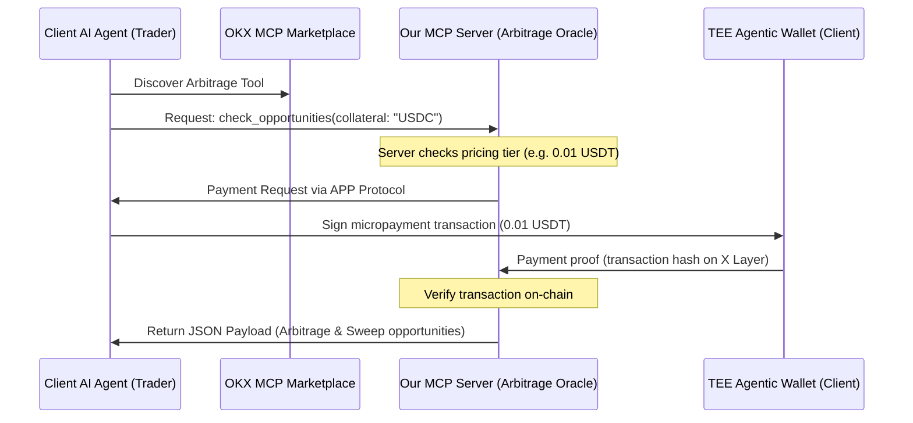

# Blueprint: Monetizing an MCP Arbitrage Oracle on OKX Marketplace

This blueprint details the requirements, operational flow, key functions, and output schemas to build and sell a **Real-Time Arbitrage & Late-Stage Sweep Data Oracle** on the OKX MCP Marketplace. 

AI trading agents running in the ecosystem will pay a micro-fee (via the APP protocol) to invoke this tool to find profitable setups.

---

## 1. Requirements Analysis (Analisa Kebutuhan)

### A. Data Inputs & Integrations
To provide high-value, actionable arbitrage signals, our MCP server needs connections to:
1. **OKX DEX Aggregator API**: To retrieve real-time spot prices for tokens across X Layer, Ethereum, and Solana.
2. **Exchange OS Market API**: To retrieve the current bid/ask prices of prediction market contracts (e.g., YES/NO shares).
3. **External Oracles (Pyth / Chainlink)**: As a high-speed reference price to calculate if an outcome is mathematically decided.

### B. Monetization & Payment (APP Protocol)
* **Token**: USDT on X Layer (`0x74b7f16337b8972027f6196a17a631ac6de26d22`).
* **Pricing Model**: Pay-per-use microtransactions.
* **Pricing Target**: **0.01 USDT to 0.05 USDT** per API/Tool invocation.
* **Payment Flow**: Verified automatically via the Onchain OS APP (Agent Payment Protocol) header/handshake before the tool returns the data payload.

---

## 2. Operational Flow (Alur Kerja)



1. **Discovery**: A trading agent searches the OKX MCP Marketplace and finds our `arbitrage-oracle` tool.
2. **Request**: The trading agent sends an invocation request.
3. **Payment**: The Onchain OS SDK intercepts the request and pays **0.01 USDT** from the trader's TEE wallet to our developer wallet.
4. **Verification**: Our MCP server verifies the transaction hash on X Layer.
5. **Payload**: The server executes the scan and returns a structured JSON of active, profitable arbitrage and sweep opportunities.

---

## 3. Core Functions (Fungsi Utama)

Our MCP server will expose two primary tools:

### Tool 1: `get_arbitrage_opportunities`
Scans and identifies price gaps between prediction markets and spot index prices.
* **Input Parameters**:
  * `minSpread` (number, default: 0.02): Minimum spread percentage (e.g., 2%) to filter results.
  * `category` (string, optional): Filter by category (e.g., "crypto", "sports", "macro").
* **Logika Internal**:
  * Fetch all active markets on Exchange OS.
  * Fetch current spot/perp index prices.
  * Calculate delta: $\text{Spread} = \text{Spot Price} - \text{Prediction Price}$.
  * Filter and return opportunities exceeding `minSpread`.

### Tool 2: `get_late_stage_sweeps`
Scans for winning outcome shares trading below $1.00 where the probability of winning is $>97\%$.
* **Input Parameters**:
  * `maxPrice` (number, default: 0.99): The maximum buy price of the winning share.
* **Logika Internal**:
  * Filter prediction markets with $<10$ seconds to expiry or where the price distance to the index threshold makes a reversal mathematically impossible.
  * Identify YES/NO contract prices trading between $0.90$ and $0.99$.

---

## 4. Output Formats (Hasil Output)

The output must be returned as a clean, standardized JSON array so that calling AI agents can easily parse and execute trades programmatically.

### Example Output for `get_arbitrage_opportunities`:
```json
[
  {
    "marketId": "xlayer-btc-95k-yes",
    "marketTitle": "Will Bitcoin close above $95,000 on June 5th?",
    "predictionPrice": 0.82,
    "spotPrice": 95420.00,
    "targetSpreadPercent": 4.25,
    "recommendedHedging": {
      "strategy": "Arbitrage",
      "action": "Buy YES shares on Exchange OS + Short BTC Perp on OKX DEX",
      "minCapitalRequiredUSDT": 100
    }
  }
]
```

### Example Output for `get_late_stage_sweeps`:
```json
[
  {
    "marketId": "wc-2026-arg-ger-win",
    "marketTitle": "World Cup: Argentina vs. Germany (Argentina current score 2-0, Minute 88)",
    "winningOutcome": "Argentina",
    "sharePriceUSDT": 0.985,
    "expectedPayoutUSDT": 1.00,
    "expectedROI": 1.52,
    "remainingTimeSeconds": 120,
    "isDeterministic": true
  }
]
```
